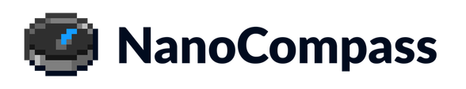

=========
NanoCompass is plugin for Spigot server which shows compass on player's actionbar made by NanoDot. Team.

# Plugin functions
- commands for players that allow to disable/enable compass
- saving preferences of players to config

# Quick tutorial
This is the quick guide on the plugin functions.
## Disabling or enabling entire plugin
You can change if plugin is enabled or disabled in NanoCompass' config.yml file.
## Commands
You can change if compass is displayed for you using /nanocompass off or /nanocompass on commands, these options  are saved in config.yml, so after restart they do not change.

# Contributing
Just contact our team on Discord, then we will discuss about your improvments and hopefully after that you'll just need to make pull request. 

## Bugs
If you would find a bug just go to NanoDot Discord and tell us about it. Different way of reporting is opening issue there, on GitHub. 

# Important links
- NanoDot Discord - https://discord.gg/mBjFXxs

# Terms of use
1. You must follow Creative Commons CC BY-NC-SA rules you can find there -- https://creativecommons.org/licenses/by-nc-sa/4.0/legalcode.
2. Additionaly you must add a link to our team in place, where you share our plugin(s) or adapted form of our plugin(s). Text must have same colour and same font-size as rest of the website text.

If you're not sure about our terms you could ask us about it on NanoDot discord.
